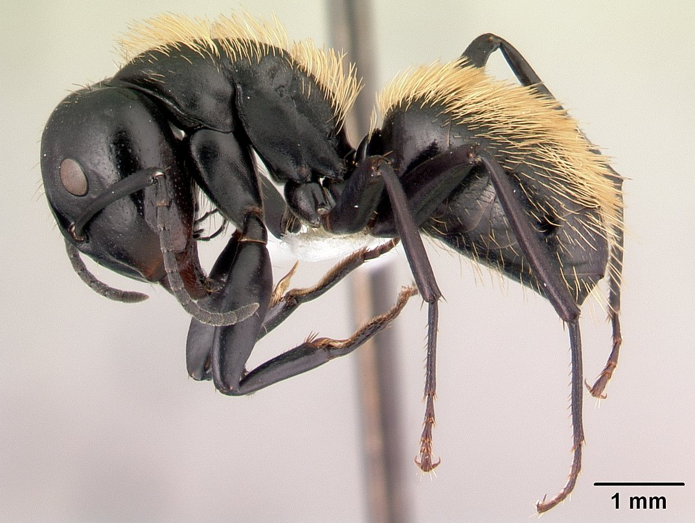

# The wonderful world of ants

Cool species of ants!
1. [**Campontus-darwinii**](https://www.antwiki.org/wiki/Camponotus_darwinii)

2. [**Rhytidoponera-metallica**](https://www.antwiki.org/wiki/Rhytidoponera_metallica)

3. [**Acanthomyrmex-ferox**](https://www.antwiki.org/wiki/Acanthomyrmex_ferox)

4. [**Cataglyphis-fortis**](https://antwiki.org/wiki/Cataglyphis_fortis)

|Are | ants | cool?|
|---|:---:|---|
|**Yes**| they | are!|
